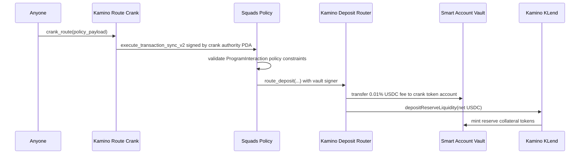

# Smart Accounts Kamino Route Crank Flow

This document describes the new Kamino routing setup where anyone can trigger a
crank, Squads policy validation still decides whether the action is allowed, and
the deposit router program takes a 0.01% USDC fee before depositing the rest
into Kamino.

The target call chain is:

```text
anyone -> kamino-route-crank -> Squads policy -> kamino-deposit-router -> fee + deposit
```

## Why The Router Exists

The previous policy shape allowed a Squads policy execution to call the Kamino
lend deposit instruction directly. That works for a trusted automation worker,
but it does not give the crank a permissionless incentive and it leaves fee
collection outside the enforced on-chain path.

The new setup uses two programs so the outer crank does not re-enter the same
program through Squads:

- `programs/kamino-route-crank` is the permissionless entrypoint anyone calls.
  It signs Squads synchronous execution with a policy-specific crank authority
  PDA.
- `programs/kamino-deposit-router` is the only program the Squads policy allows.
  It performs the fee transfer plus the Kamino deposit in one atomic
  instruction.

The important boundary is:

- Squads policy decides whether the vault is allowed to route USDC.
- Kamino Deposit Router decides how much is routable, deducts the crank fee,
  and CPIs into KLend.
- The off-chain crank only submits the transaction. It cannot route funds unless
  the policy and deposit-router checks both pass.

## Actors

| Actor                 | Role                                                                                |
| --------------------- | ----------------------------------------------------------------------------------- |
| Smart account vault   | Holds the user's USDC and receives Kamino collateral tokens.                        |
| Squads policy         | Validates the synchronous policy payload and authorizes the vault signer.           |
| Kamino Route Crank    | Permissionless outer entrypoint that invokes Squads with the crank authority PDA.   |
| Kamino Deposit Router | Enforces fee math, reserve/account checks, and the KLend deposit CPI.               |
| Crank caller          | Pays transaction fees, optionally pays ATA rent, and receives the USDC routing fee. |
| Kamino KLend          | Receives net USDC liquidity and mints reserve collateral tokens to the vault.       |

## Entry Points

The flow is split across two programs.

### `crank_route`

This is the permissionless entry point in `programs/kamino-route-crank`.

Anyone can call it with a serialized Squads synchronous policy payload. The
route-crank program signs the Squads `execute_transaction_sync_v2` instruction
with its crank authority PDA:

```text
PDA seeds: ["kamino_route_crank", policy]
```

That PDA should be configured as the policy signer. Because the PDA is derived
from the policy address, each policy gets its own crank authority.

The crank caller does not directly sign as the policy authority. Instead:

1. The caller signs the outer transaction.
2. `kamino-route-crank::crank_route` invokes Squads.
3. The route-crank program signs the Squads sync execution as the crank
   authority PDA.
4. Squads validates the policy payload.
5. If the policy passes, Squads executes the inner deposit-router instruction.

### `route_deposit`

This is the entry point in `programs/kamino-deposit-router` that the Squads
policy execution calls.

It expects the Squads vault to be the signer, because the vault must authorize
the USDC fee transfer and the KLend deposit. It then:

1. Reads the vault USDC token account balance.
2. Leaves `keep_liquidity_amount` in the vault.
3. Treats the rest as the routable amount.
4. Transfers `0.01%` of the routable amount to the crank fee token account.
5. Deposits the remaining USDC into the configured Kamino reserve.
6. Verifies that the expected USDC was consumed and collateral was minted.

For USDC, amounts are expressed in base units with 6 decimals.

## Flow



## Policy Shape

The policy should no longer allow a direct top-level Kamino deposit instruction.
Instead, it should allow the Kamino Deposit Router program and the `route_deposit`
instruction.

Recommended policy constraints:

| Constraint                                                                   | Purpose                                                             |
| ---------------------------------------------------------------------------- | ------------------------------------------------------------------- |
| Top-level program id is Kamino Deposit Router                                | Prevents direct arbitrary KLend calls through the policy.           |
| Instruction discriminator is `route_deposit`                                 | Limits the policy to the fee-plus-deposit path.                     |
| Source token account is the vault USDC ATA                                   | Ensures user funds come only from the smart account vault.          |
| Source token mint is the expected USDC mint for the selected environment     | Prevents routing an unexpected asset.                               |
| Source token balance is above the threshold                                  | Keeps minimum liquidity in the vault before routing.                |
| Kamino reserve, market, supply, and collateral mint accounts match constants | Prevents redirecting deposits to an unexpected reserve.             |
| Optional spending limit on USDC                                              | Caps how much USDC this policy can move over the configured period. |

The deposit router also validates critical account relationships on-chain, so
the policy and deposit-router checks overlap intentionally. The policy is the
authorization layer; the deposit router is the execution safety layer.

`scripts/create-kamino-router-policy.ts` implements this policy shape. It is a
router-policy rewrite of `scripts/create-kamino-lending-policy.ts`: the old
script allowed direct KLend deposit instructions, while the new script allows
only a Squads synchronous payload whose single instruction is
`kamino-deposit-router::route_deposit`.

The script pins:

- the `route_deposit` discriminator,
- `keep_liquidity_amount` and `minimum_deposit_amount`,
- vault, source USDC ATA, token mint, Kamino market/reserve/supply/collateral
  constants,
- token, associated token, system, instruction sysvar, and KLend program ids.

By default it does not pin the fee token account. That is the permissionless
crank shape: the deposit router dynamically checks that the fee account is a
USDC token account owned by the crank signer and is not the vault source account. Use
`--pin-fee-token-account` only for a first-party crank deployment.

## Threshold And Fee Math

The routing amount is computed on-chain from the token account balance at
execution time:

```text
routable_amount = source_usdc_balance - keep_liquidity_amount
fee_amount = floor(routable_amount * 1 / 10_000)
deposit_amount = routable_amount - fee_amount
```

`1 / 10_000` basis points is `0.01%`.

If `source_usdc_balance <= keep_liquidity_amount`, the instruction fails. If the
resulting deposit is below `minimum_deposit_amount`, the instruction also fails.

This means the crank can estimate profitability off-chain, but the final amount
is always decided on-chain from the live vault balance.

## Crank Transaction Assembly

A crank worker should:

1. Derive the smart account vault and the vault USDC ATA.
2. Read the vault USDC balance.
3. Skip if the balance is not above the configured threshold.
4. Build a Squads synchronous policy payload containing one instruction:
   `kamino-deposit-router::route_deposit`.
5. Call `kamino-route-crank::crank_route` with that serialized policy payload.
6. Pass the remaining accounts required by Squads and by `route_deposit`.

The off-chain balance check is only an optimization. The authoritative threshold
check happens inside the policy and deposit-router execution.

If the policy has an expiration or settings account requirement, the crank must
include the required Squads accounts in the remaining accounts passed to
`crank_route`, in the order expected by Squads sync execution.

`scripts/crank-kamino-router.ts` performs this assembly. It:

1. Fetches the policy and checks it is a `ProgramInteraction` policy.
2. Derives the route-crank authority PDA from the policy.
3. Builds the inner `route_deposit` instruction.
4. Converts it to Squads synchronous transaction details with the crank
   authority as the policy signer.
5. Serializes the `ProgramInteraction` policy payload.
6. Calls `kamino-route-crank::crank_route` with the serialized policy payload and
   the Squads remaining accounts.

## Fee Account Model

For a permissionless crank market, the fee token account can be the caller's
USDC ATA. The router validates that:

- the fee account uses the same USDC mint,
- the fee account is owned by the crank signer,
- the fee account is not the source vault token account.

If Loyal wants only first-party routing, the policy builder can instead pin a
specific fee token account. The deposit router supports the more general
permissionless shape, while policy constraints can narrow it for a specific
deployment.

## Atomicity

The fee transfer and Kamino deposit happen in the same transaction and through
the same deposit-router instruction. If the KLend deposit fails, the entire
transaction rolls back, including the fee transfer. The crank only gets paid
when the route actually succeeds.

## Create The Deposit Router Policy

Run the policy creation script with a settings signer. It creates a settings
transaction containing `SettingsAction::PolicyCreate`, adds the route-crank
authority PDA as the policy signer, and optionally approves and executes the
settings transaction.

Mainnet example:

```bash
bun run smart-accounts:create-kamino-deposit-policy \
  --user GkdMzeytzbhjrkXQvdrB4tXHuP6vAmgccpjSb3WTaPm3 \
  --keypair ~/.config/solana/id.json \
  --solana-env mainnet \
  --keep-liquidity-usdc 500 \
  --minimum-deposit-usdc 0.000001 \
  --threshold-operator gt \
  --execute
```

Devnet example:

```bash
bun run smart-accounts:create-kamino-deposit-policy \
  --settings-pda <SETTINGS_PDA> \
  --keypair ~/.config/solana/id.json \
  --solana-env devnet \
  --keep-liquidity-usdc 50 \
  --minimum-deposit-usdc 0.000001 \
  --execute
```

Use `--fee-payer-keypair` when rent and transaction fees should be sponsored by
a different signer.

Supported override arguments for expected constants:

```text
--program-id
--deposit-router-program-id
--route-crank-program-id
--usdc-mint
--klend-program-id
--lending-market
--lending-market-authority
--reserve
--reserve-liquidity-supply
--reserve-collateral-mint
--vault-collateral-token-account
--instruction-sysvar-account
--token-program-id
--associated-token-program-id
--system-program-id
```

The `--solana-env devnet` path assumes the deployed deposit router program was
built with the deposit router's devnet constants. If the deployment uses
different constants, pass the override arguments above.

The script prints the created policy PDA, the derived crank authority PDA, and
both program ids. Save the `policyPda` for the crank command.

## Run A Permissionless Crank

Any signer can run the crank script. The signer pays transaction fees, receives
the USDC crank fee, and does not need to be a smart account signer.

```bash
bun run smart-accounts:crank-kamino-route \
  --policy-pda <POLICY_PDA> \
  --keypair ~/.config/solana/id.json \
  --solana-env mainnet \
  --keep-liquidity-usdc 500 \
  --minimum-deposit-usdc 0.000001 \
  --simulate
```

For devnet:

```bash
bun run smart-accounts:crank-kamino-route \
  --policy-pda <POLICY_PDA> \
  --keypair ~/.config/solana/id.json \
  --solana-env devnet \
  --keep-liquidity-usdc 50 \
  --minimum-deposit-usdc 0.000001 \
  --simulate
```

The default fee account is the crank signer's USDC ATA. The script prepends an
idempotent ATA creation instruction for that account. If you pass
`--fee-token-account`, also pass `--no-create-fee-ata` unless that account is
the crank signer's ATA.

## Test Checklist

1. Validate the scripts load and show their arguments:

   ```bash
   bun run scripts/create-kamino-router-policy.ts --help
   bun run scripts/crank-kamino-router.ts --help
   ```

2. Create the policy on devnet first, with small `--keep-liquidity-usdc` and
   `--minimum-deposit-usdc` values.

3. Confirm the policy JSON output:

   - `depositRouterProgramId` matches the deployed deposit router.
   - `routeCrankProgramId` matches the deployed route crank.
   - `crankAuthority` is derived from `["kamino_route_crank", policyPda]`.
   - `sourceLiquidity` is the vault USDC ATA unless intentionally overridden.
   - `feeLiquidityPinned` is `null` for permissionless cranks.

4. Run the crank with `--dry-run` or `--simulate`. The simulation should fail
   with `ThresholdNotMet` when the vault USDC balance is at or below
   `keep_liquidity_amount`, and should pass once the vault has excess USDC.

5. After a successful crank, verify:

   - the vault USDC balance decreased to the configured keep-liquidity amount,
   - the crank fee ATA received `floor(routable_amount / 10_000)`,
   - the vault collateral ATA received Kamino collateral tokens,
   - a second immediate crank fails or routes only newly excess liquidity.

## Implementation References

- Permissionless crank program: `programs/kamino-route-crank`
- Permissionless entry point: `programs/kamino-route-crank/src/instructions/crank_route.rs`
- Deposit router program: `programs/kamino-deposit-router`
- Policy-called entry point: `programs/kamino-deposit-router/src/instructions/route_deposit.rs`
- Existing policy flow reference: `docs/solana/smart-accounts-kamino-policy-flow.md`
- Deposit policy creation script: `scripts/create-kamino-router-policy.ts`
- Permissionless crank script: `scripts/crank-kamino-router.ts`

## Devnet Validation

Validated on devnet with the hardcoded devnet Kamino reserve constants:

- Deposit router program: `4MDtYRz8fbRfk3AbxdDJ2nCejQrSxcemAyZW9EEZDrtX`
- Route crank program: `4RVMhCMFzQGwtKZFdowuMzChpsHhHFWvt8a7tVb4hqa6`
- Smart account settings: `3T2kxNJ6DJGBNwSurz5Xh2ybehWMoteKi8meRC6NEPcZ`
- Vault: `Db3qSVBhJggmAMAAb4mCTHuoLnCpD9HXXYwZTGNgamhN`
- Policy: `CK9dMhxvtmF7Ubv2CNN8vB8SZFhwYsWgrZjuS5V8pC4n`
- Crank authority PDA: `AZEWaYoq87JtMZmzUXXMddF975pWpRtpafUXgRvrFi3n`
- Crank signature: `3RpnVqNAHQEP3GYBVk98s5TwxwdMk6HGbLFERoTC4abJK1fXJgBedRmF8yaE2dr3C73wmZERfdA88uTaouxdgpWi`

For the 11 USDC vault test with a 10 USDC keep-liquidity threshold, the routed
amount was 1 USDC. The route deducted `0.0001` USDC to the crank fee ATA and
deposited `0.9999` USDC to Kamino, leaving the vault USDC ATA at `10`.
