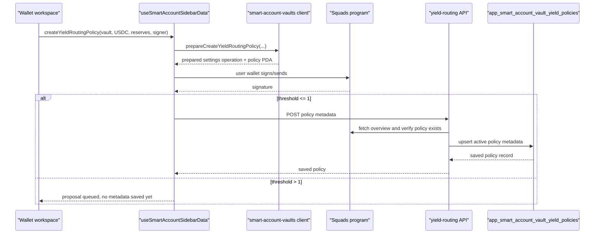

# Smart Accounts Yield Optimization Flow

This document describes the frontend-owned yield optimization flow for Loyal
smart-account vaults. It covers the current Kamino USDC opt-in path, the
on-chain policy shape, the app metadata that makes policies discoverable, and
the cron boundary for future optimizer execution.

The current implementation creates and stores a vault-scoped Kamino rebalance
policy. It does not yet submit live rebalance transactions from cron; cron
currently scans due policy metadata and is the handoff point for the optimizer
worker.

## Goal

Users with a ready Loyal smart account should be able to opt a vault into
Kamino yield routing from the web frontend. The opt-in creates a Squads
`ProgramInteraction` policy under the user's existing `Settings` account. The
policy gives a configured optimizer signer enough authority to submit only the
allowed Kamino deposit and redeem instructions for the selected vault and
allowed reserve set.

This keeps ownership split cleanly:

- the user remains the root smart-account owner and signs policy creation
- the optimizer signer is not added as a root `Settings` signer
- the optimizer signer only appears inside the yield-routing policy
- the database stores scheduling/index metadata, not policy authority

## User Flow

The prompt appears in the wallet workspace when all of these are true:

- the user is signed in and has a ready smart account
- a vault is selected
- the selected vault has a positive balance for the configured route mint
- `getYieldRoutingDefaults` has defaults for the current Solana environment

For the first version, the supported route mint is USDC:

| Environment | Mint | Reserve | Market |
| --- | --- | --- | --- |
| `mainnet` | `EPjFWdd5AufqSSqeM2qN1xzybapC8G4wEGGkZwyTDt1v` | `9GJ9GBRwCp4pHmWrQ43L5xpc9Vykg7jnfwcFGN8FoHYu` | `CqAoLuqWtavaVE8deBjMKe8ZfSt9ghR6Vb8nfsyabyHA` |
| `devnet` | `4zMMC9srt5Ri5X14GAgXhaHii3GnPAEERYPJgZJDncDU` | `9uKMtFU9UJ9DfbwzCReGENb31appi79KTEeDGdCnvMjy` | `27MKCQo5qP7ijrwWSMKX2Jeb3PhK2NZmHQ9befWVRS4J` |

The browser flow is:

1. `AppWalletWorkspace` computes defaults from public env and selected vault.
2. The selected stash detail view shows `Enable yield routing`.
3. The user clicks `Enable`.
4. `useSmartAccountSidebarData.createYieldRoutingPolicy` validates the wallet,
   route mint, optimizer signer, vault, and reserve list.
5. The hook asks `packages/smart-account-vaults` to prepare a settings change.
6. The user's wallet signs and sends the prepared operation.
7. For threshold `1` settings, the policy is created immediately and metadata is
   saved through `POST /api/smart-accounts/yield-routing`.
8. For threshold greater than `1`, the settings proposal is queued and metadata
   is not saved until the policy exists on chain.

The Earn screen also uses this route. Pressing the red `Deposit` button in the
Earn deposit view now dispatches real business logic based on the selected
source:

- `Main` deposits USDC through the existing private-transfer shield flow. For
  tracked USDC this program supplies liquidity to Kamino and records the local
  Kamino basis used by the wallet portfolio view.
- `Stash` creates the Kamino rebalance policy when needed, then submits a
  smart-account custom-instruction proposal that creates the vault collateral
  token account idempotently and calls Kamino `depositReserveLiquidity` from
  the selected vault.
- For threshold greater than `1`, the Earn screen returns a proposal message
  instead of pretending the deposit executed immediately.



## Policy Shape

The policy is created through `PolicyCreate` as a `ProgramInteraction` payload:

- parent settings: current user's `settingsPda`
- account index: selected vault account index
- policy signer: `NEXT_PUBLIC_YIELD_ROUTING_DELEGATED_SIGNER`
- policy threshold: `1`
- policy time lock: `0`
- target program: Kamino Lend
  `KLend2g3cP87fffoy8q1mQqGKjrxjC8boSyAYavgmjD`

The policy currently allows two instruction families:

- Kamino `redeemReserveCollateral`
- Kamino `depositReserveLiquidity`

Those two constraints are packed into one rebalance policy because an optimizer
rebalance may need to withdraw from one supported reserve and deposit into
another supported reserve.

### Deposit Constraint

Deposit instructions must satisfy:

- program id equals the Kamino Lend program
- account `0` is the selected smart-account vault
- account `1` is one of the allowed reserve addresses
- account `2` is one of the allowed market addresses
- account `4` is one of the allowed liquidity mints and is owned by SPL Token
- accounts `9` and `10` are the SPL Token program
- instruction data at offset `0` equals the Kamino deposit discriminator
  `[169, 201, 30, 126, 6, 205, 102, 68]`

### Redeem Constraint

Redeem instructions must satisfy:

- program id equals the Kamino Lend program
- account `0` is the selected smart-account vault
- account `1` is one of the allowed market addresses
- account `2` is one of the allowed reserve addresses
- account `4` is one of the allowed liquidity mints and is owned by SPL Token
- accounts `9` and `10` are the SPL Token program
- instruction data at offset `0` equals the Kamino redeem discriminator
  `[234, 117, 181, 125, 185, 142, 220, 29]`

The account indexes match the real KLend instruction layouts used by the
private-transfer Kamino CPI integration, not the older mock-yield test program.

## Persistence Model

The on-chain policy account is the source of authority. The app table stores
only the durable metadata needed by the UI and by cron/worker scans.

Table: `app_smart_account_vault_yield_policies`

Important fields:

| Field | Purpose |
| --- | --- |
| `user_id` | Owning app user |
| `smart_account_id` | Owning app smart-account row |
| `solana_env` | Environment partition |
| `settings_pda` | Parent Squads settings account |
| `vault_address` | Smart-account vault PDA for `account_index` |
| `account_index` | Vault index the policy controls |
| `kind` | Currently `kamino_rebalance` |
| `state` | `active`, `paused`, `failed`, or `archived` |
| `route_mint` | Mint being optimized, currently USDC |
| `rebalance_policy_pda` | On-chain policy PDA |
| `rebalance_policy_seed` | Seed used to derive the policy PDA |
| `delegated_signer` | Optimizer signer allowed by the policy |
| `allowed_reserves` | Reserve allowlist stored for worker planning |
| `allowed_markets` | Market allowlist stored for worker planning |
| `allowed_liquidity_mints` | Liquidity mint allowlist stored for worker planning |
| `creation_signature` | Transaction signature that created the policy when known |
| `last_cranked_at` | Last optimizer execution timestamp |
| `next_crank_after` | Scheduler cursor for cron/worker scans |
| `last_crank_signature` | Last optimizer transaction signature |
| `last_error_code` / `last_error_message` | Last worker failure |

Unique indexes enforce one active metadata row per environment and policy PDA,
and one row per environment/settings/account-index/route-mint tuple.

## API Contract

### `GET /api/smart-accounts/yield-routing`

Returns the current user's saved yield-routing policy metadata.

The route requires an authenticated principal and resolves the current ready
smart account for the server Solana environment.

### `POST /api/smart-accounts/yield-routing`

Saves policy metadata after the on-chain policy has been created.

The request includes:

- `accountIndex`
- `vaultAddress`
- `routeMint`
- `rebalancePolicyPda`
- `rebalancePolicySeed`
- `delegatedSigner`
- `allowedReserves`
- `allowedMarkets`
- `allowedLiquidityMints`
- optional `creationSignature`

Before writing metadata, the server re-fetches the smart-account overview with
the policy PDA invalidated and verifies:

- the vault exists under the authenticated smart account
- the submitted vault address matches the on-chain vault address
- the on-chain policy exists
- the policy is a `ProgramInteraction` policy
- the policy account index matches the submitted account index
- the submitted optimizer signer is one of the policy signers

If RPC reads are rate limited, the route returns `429` with `Retry-After`.
The browser metadata save helper retries `409` and `429` because fresh policy
accounts may take a moment to appear in RPC reads.

## Cron Boundary

The Vercel cron entry is:

```json
{
  "path": "/api/cron/yield-routing",
  "schedule": "0 * * * *"
}
```

The route requires `Authorization: Bearer ${CRON_SECRET}` when `CRON_SECRET` is
configured. In non-production environments without `CRON_SECRET`, the route is
allowed for local/manual testing.

Current cron behavior:

1. query active policy rows where `next_crank_after <= now`
2. return counts for due/scanned policies
3. do not submit optimizer transactions yet

Expected future worker behavior:

1. load due active policies
2. fetch the vault's current Kamino position and available route balances
3. choose whether optimization is worthwhile after fees and slippage
4. build only instructions allowed by the stored policy constraints
5. submit through the policy path using the optimizer signer
6. write `last_cranked_at`, `last_crank_signature`, errors, and next schedule

## Environment

Frontend public configuration:

```bash
NEXT_PUBLIC_YIELD_ROUTING_DELEGATED_SIGNER=<optimizer signer pubkey>
```

Server cron configuration:

```bash
CRON_SECRET=<shared cron bearer token>
```

`NEXT_PUBLIC_YIELD_ROUTING_DELEGATED_SIGNER` is intentionally public because it
is a policy signer identity shown to and approved by users during policy
creation. The private key for that signer must only live in the future worker or
secure signing service.

## Important Boundaries

- Creating the policy is a user-authorized settings change.
- Saving metadata is only allowed after the server verifies the on-chain policy.
- The metadata table does not grant authority and should not be trusted without
  re-checking on-chain policy state before execution.
- The current routing setup only creates the Kamino rebalance policy. It does
  not create a Jupiter or Loyal Hub swap policy for cross-mint routes.
- The Loyal Hub swap program source lives at
  `programs/loyal-hub-swap-program`, but it is still a raw Solana program with
  no production program id in `Anchor.toml`. Add a real deploy key/program id
  before enabling hub swap lanes in policy constraints or cron execution.
- Threshold greater than `1` settings produce a proposal. Metadata is deferred
  because the policy PDA is not active until the proposal is executed.
- The first supported mainnet reserve is Kamino Prime USDC. Expanding the
  reserve set should update both `getYieldRoutingDefaults` and worker planning.

## Key Files

- `packages/smart-account-vaults/src/yield-routing.ts`
- `packages/smart-account-vaults/src/client.ts`
- `frontend/src/features/yield-routing/defaults.ts`
- `frontend/src/features/yield-routing/server/repository.ts`
- `frontend/src/features/yield-routing/server/runner.ts`
- `frontend/src/app/api/smart-accounts/yield-routing/route.ts`
- `frontend/src/app/api/cron/yield-routing/route.ts`
- `frontend/src/hooks/use-smart-account-sidebar-data.ts`
- `frontend/src/components/wallet-workspace/app-wallet-workspace.tsx`
- `frontend/src/components/wallet-sidebar/earn-detail-view.tsx`
- `frontend/src/components/wallet-sidebar/stash-detail-view.tsx`
- `programs/loyal-hub-swap-program/src/lib.rs`
- `packages/db-core/src/schema.ts`
- `app/drizzle/0023_yield_routing_policies.sql`
