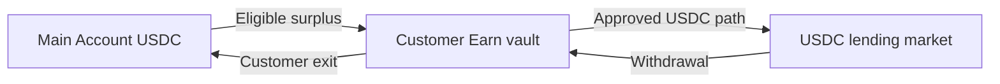

Eligible USDC moves from the Main Account into the customer's Earn vault, then into an approved USDC lending market.

USDC stays USDC.

Loyal does not swap the customer's principal into another asset along the supported route.

Rates can change at any time. Market liquidity can also affect how quickly a withdrawal completes. While funds are supplied, the customer remains exposed to the underlying market and USDC risks.

<Note>
  The current product uses approved markets. A policy boundary limits where a
  transaction may go; it does not make the underlying market risk-free.
</Note>

Developers who need the implementation path can inspect [same-mint routing](/earn/same-mint-optimization) and [market selection](/earn/orchestrator). Those pages own route mechanics and skip logic. Customer evaluation belongs in [Risk and liquidity](/trust/risk-and-liquidity), where each technical dependency is translated into an outcome.
