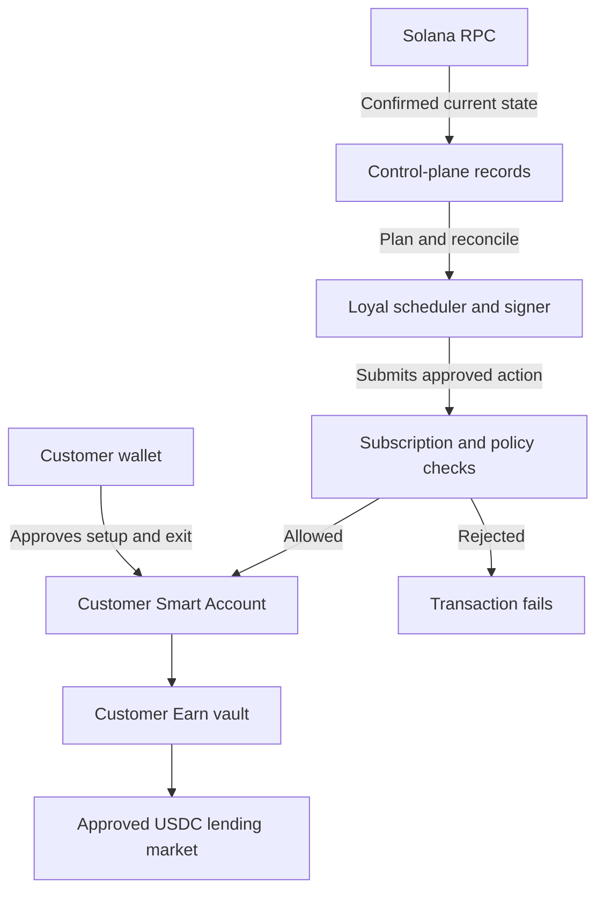

The customer controls setup and exit. Loyal schedules work through limited authority. Onchain state proves account authority and confirmed execution; control-plane records explain what Loyal planned and reconciled.

## Boundary by concern

| Concern | Authoritative source |
| --- | --- |
| Root authority and current signer configuration | Solana account state |
| Allowed transaction shape | Current Smart Account policy state |
| Recurring period and delegation | Current subscription state |
| Lending position and token balances | Solana and the underlying lending program |
| Planned work, skip reason, and reconciliation | Loyal's durable control-plane records |
| Realtime notification | A wake-up signal that triggers a canonical refetch |

Do not treat a submitted signature as confirmation or a realtime payload as the current balance.

Continue to [Automation lifecycle](/build/automation-lifecycle) for state transitions and [Runtime state and evidence](/build/state-events-and-receipts) for proof.
